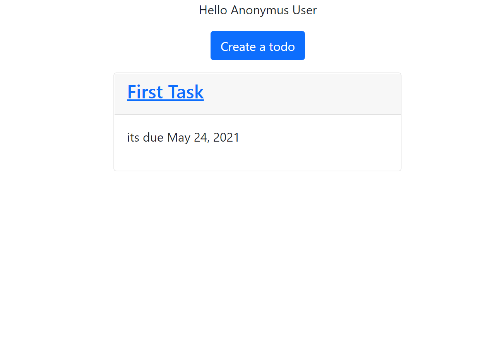
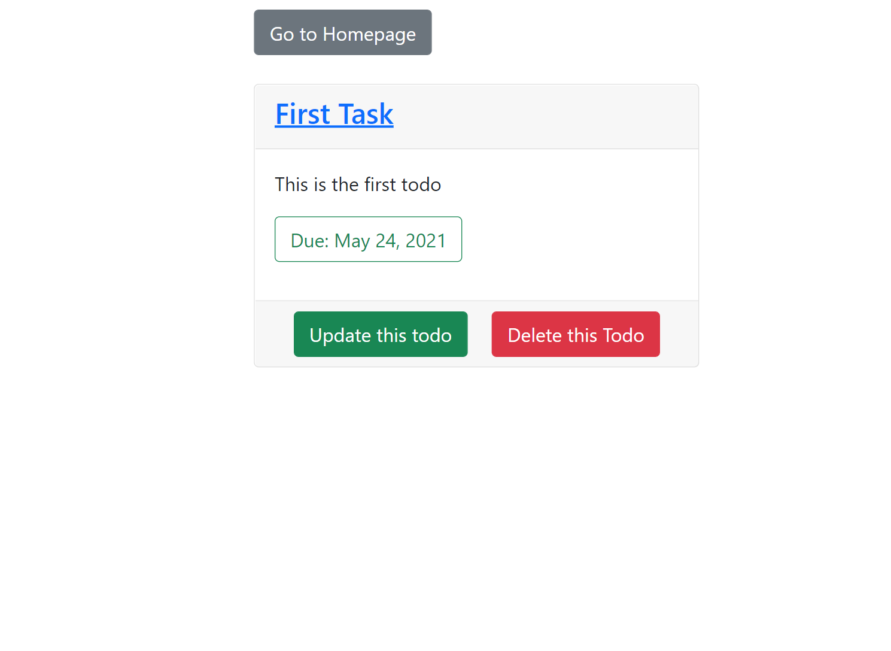
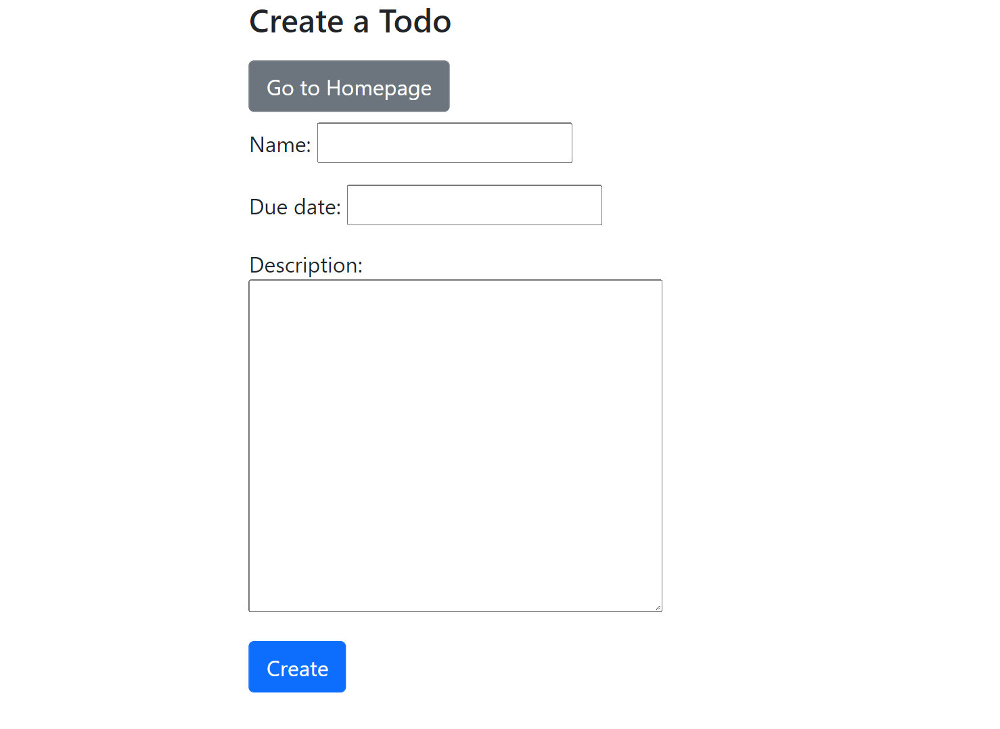
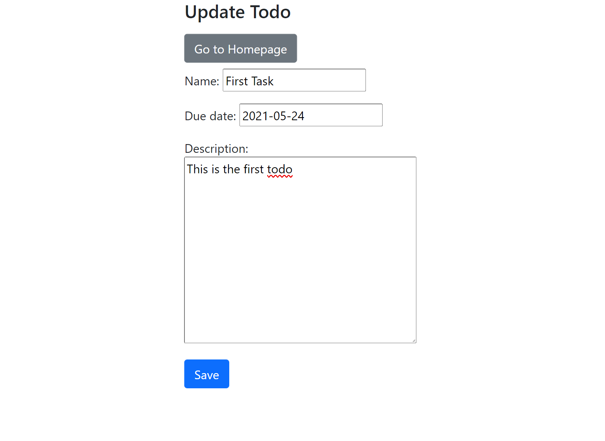

# Todo App
This is a Todo App made Using Django.
 
It includes all the basic CRUD Operations.
 
The website is styled using Bootststrap 5.
 
The Basic Functionalities are creating a todo, updating it, viewing it and deleting it.
 

### Home Page
<pre>
    This is the root page where you can view all the items added to the todo list.
</pre>

### Detail Page
<pre>
    On clicking the name of the todo item on your homepage you will be redirected to this page where 
    you can view the details of your Todo Item.

    Here you can see the options to update or delete the todo.

    On clicking the delete button the selected todo will be deleted and you will be redirected 
    to homepage
</pre>

### Update page
<pre>
    On clicking the update button you will be redirected to this page where you can alter
    the details of your ToDo item.

    On clicking the save button the changes are saved and you are redirected to the 
    homepage of the website
</pre>

### Create page
<pre>
    On homepage there is a button to create a todo 

    on clicking that button you are taken to this page. 
    This page allows you to create a new ToDo item.

    on pressing the create button on this page the new Todo Item will be saved and 
    you will be redirected to homepage with all the additions reflected.
</pre>

## Screenshots

### Homepage & Detail page

    
    

### Create and update page

    
    

